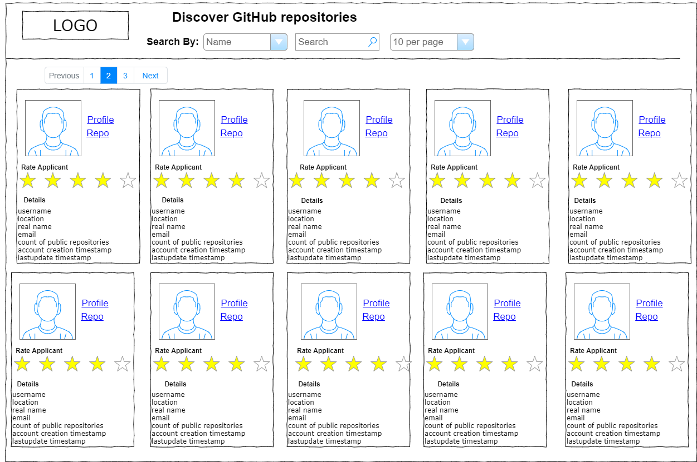

# DiscoveryGitHub

## Building a User Search Frontend
A client would like to be able to quickly discover GitHub repositories belonging to potential
programming applicants. To solve this problem, ResultStack has suggested utilizing the free GitHub
REST API (https://docs.github.com/en/free-pro-team@latest/rest) to develop a simple frontend where
users in HR can enter in a real name or email address and return a list of users matching the search
criteria. Other requirements:

## Requirements
1. The application should be built using a modern JS framework (i.e., Angular, React or Vue).
2. The app should consist of a single page with a single search bar.
3. Results should instantly display on the same page as the search bar as the user searches.
4. The search results should include the following attributes of the user: username, avatar,
location, real name, email, count of public repositories, account creation timestamp, and last
update timestamp.
5. Search results should be paginated or limited.
6. In appropriate places, users should be able to link out to the user’s profile, repository or other
destinations that may be helpful to the users of this application.
7. Other features may be suggested or added at your discretion to improve user experience,
usability or otherwise enhance the application.

## UI Wireframe Mockup

## Clarifications
3. Search updates when user presses enter.
5. Pagination limit can be selected 5 or 10 items per page.
6. Assume links leave SPA and navigate into Github.
7. Suggestion - Add rating (furture place holder pending data store)

